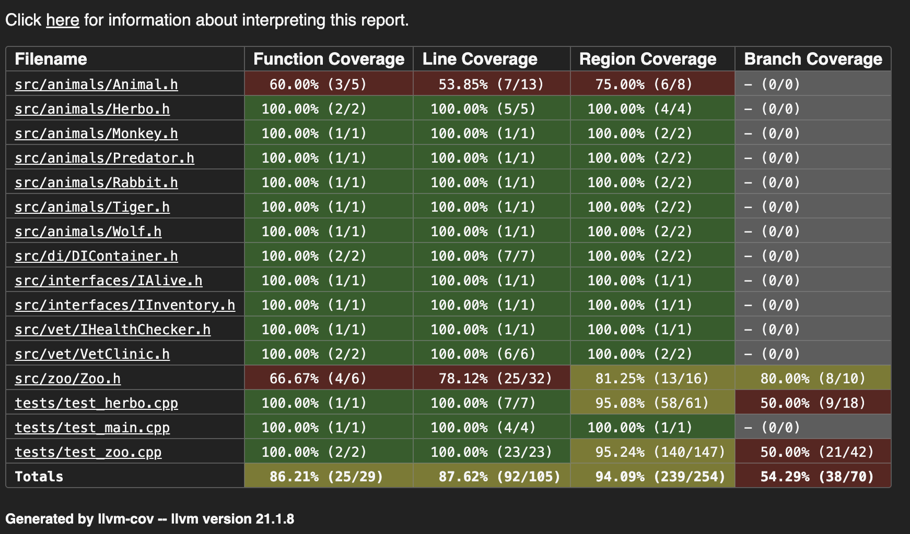

# Zoo ERP System

Приложение для учета животных, сотрудников и инвентаря зоопарка

## Функциональность
- Прием животных с проверкой здоровья
- Учет потребляемой еды
- Формирование контактного зоопарка
- Инвентаризация животных, вещей и сотрудников

Здесь сотрудников не наследую от `IAlive`, так как функционал с едой и добротой и т.д. не нужен для сотрудников, только для животных.

DI контейнеров напрямую нет в C++, поэтому сделал отдельный класс со статик полями.

## Code Coverage



(Вроде branch coverage можно не смотреть)

## SOLID

S — `Zoo` управляет только коллекцией животных, `VetClinic` проверяет здоровье

O — Добавление новых видов животных (`Monkey`, `Tiger`, ...) без изменения существующих классов, просто создаем новые классы наследники `Animal`

L — Любой наследник `Animal` может использоваться вместо базового класса

I — Разделение интерфейсов: `IAlive` для животных, `IInventory` для вещей

D — `Zoo` зависит от абстракции `VetClinic`, используется DI-контейнер

## Сборка и запуск (CMake)

```bash
mkdir build
cd build
cmake ..
cmake --build .
./ZooERP
