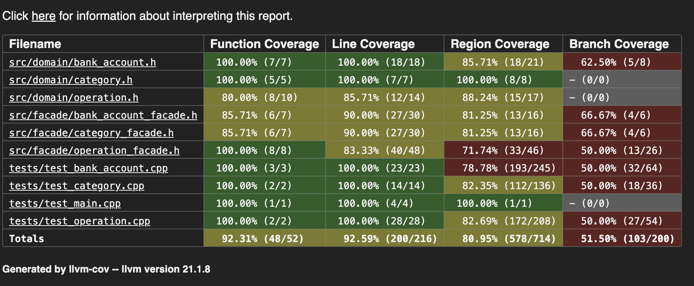

# MIPT fin-tech service

## Функциональность

- CRUD для **BankAccount**, **Category**, **Operation**
- Пополнение/списание с проверкой баланса
- Аналитика:
  - Доходы/расходы и разница по счетам
  - Группировка по категориям
  - Фильтрация по дате
- Импорт/экспорт данных (CSV/JSON/YAML)
- Измерение времени выполнения пользовательских сценариев через декоратор `TimerDecorator`

## Code Coverage



(Вроде branch coverage можно не смотреть)

## SOLID & GRASP

S — каждый фасад/класс отвечает за одну сущность (`BankAccountFacade`, `CategoryFacade`, `OperationFacade`, `AnalyticsFacade`)  
O — аналитика и команды легко расширяемы без изменения существующего кода  
L — наследуемые классы операций и аккаунтов корректно работают с базовым интерфейсом  
I — классы используют только нужные интерфейсы  
D — фасады и аналитика получают зависимости через конструктор  
- **High Cohesion / Low Coupling** — фасады взаимодействуют друг с другом минимально, каждый класс имеет четко определенную ответственность

---

## Используемые паттерны GoF

Facade — упрощение работы с BankAccount, Category, Operation  
Command + Decorator — пользовательские сценарии (добавление/списание/аналитика) оборачиваются в декоратор `TimerDecorator` для измерения времени  
Factory — создание объектов BankAccount, Category, Operation с централизованной валидацией  
Template Method / Visitor — импорт/экспорт данных через общий шаблон с различными форматами  

## Сборка и запуск (CMake)

```bash
mkdir build
cd build
cmake ..
cmake --build .
./FinanceERP